# ts-factory

A reusable software factory for any repo. Deterministic TypeScript scripts (ADWs, "AI Developer Workflows") own sequencing, retries, and acceptance. Coding agents do the work inside named phases. Typed JSON envelopes carry context between phases, and every event streams into a SQLite trace you can watch mid-run.

It ships as one Claude Code skill, `.claude/skills/sssf/`, that you copy into a repo and stamp. Bun is the runtime. There are no npm dependencies in the stamped code.

<p align="center">
  
</p>

## Prerequisites

| Tool | Why |
|---|---|
| [`bun`](https://bun.sh) | runs the ADWs, the installer, and the trace UI |
| [`pi`](https://github.com/mariozechner/pi-coding-agent) | needed for `coding_agent: pi` agents |
| [Claude Code](https://docs.anthropic.com/en/docs/claude-code) (`claude`) | needed for `coding_agent: claude_code` agents |
| Copilot CLI (`npm install -g @github/copilot`) | needed for `coding_agent: copilot` agents |
| `sqlite3` | reading the trace from the shell |
| `git` | chains that end in a commit phase need a repo with one commit |
| [`just`](https://github.com/casey/just) | optional; every recipe is a one-line `bun` or `sqlite3` command |

Plus an API key for each provider your roster names. The starter roster uses three providers. Set `defaults.model` and delete the per-agent `model:` lines to run everything on one key.

## Quick start

Run from the root of the repo you want the factory in.

```bash
mkdir -p .claude/skills && cp -r /path/to/ts-factory/.claude/skills/sssf .claude/skills/
bun .claude/skills/sssf/scripts/install.ts      # stamps adws/, prompts, config, justfile, .env.sample
cp .env.sample .env                             # set the key(s) your roster needs
pi --version                                    # or set PI_PATH in .env
git init && git commit --allow-empty -m init    # skip if this is already a git repo
just demo                                       # two cheap read-only runs, end to end
```

Green means the whole path works: config validated, session minted, pi ran, envelope parsed, trace written to `adws/adw_data/sssf.db`. Inside Claude Code, `/sssf install` does the same thing.

Re-running the installer skips files that already exist. `--force` overwrites everything it stamped, including your config and prompts, so commit first.

## Run a workflow

Every ADW takes the same arguments.

```bash
bun adws/adw_<name>.ts "<prompt or path/to/prompt.md>" [--config adws/adw_sssf_config/sssf.config.yaml] [--adw-id a1b2c3d4]
```

| ADW | Chain | Reach for it when |
|---|---|---|
| `adw_prompt` | one agent, `--agent NAME` picks who | you want one answer from one agent |
| `adw_scout` | scout | read-only recon, nothing changes |
| `adw_plan` | planner | you want the spec before any code |
| `adw_build` | builder | the plan already exists |
| `adw_quality` | code only: lint, typecheck, build | no agents at all |
| `adw_plan_build` | planner, builder, commit | small, well-understood work |
| `adw_build_test` | builder, test, bounded fix loop | there is a suite to satisfy |
| `adw_build_review` | builder, reviewer, bounded revise loop | intent matters more than a green suite |
| `adw_plan_build_test` | plan, build, test, commit | the standard chain |
| `adw_plan_build_test_quality` | same, plus lint, typecheck, build gates | the repo has quality commands worth enforcing |
| `adw_document` | git diff, documenter | write up what just shipped |
| `adw_simple_sdlc` | plan, build, test, review, document | the work is real and its shape is not obvious |

The stamped `justfile` wraps the common ones: `just plan "..."`, `just plan-build "..."`, `just sdlc "..."`, `just simple-sdlc "..."`.

**Chain workflows with `--adw-id`.** Omit it and a fresh id is minted and printed. Pass it and the run joins that session: same directories, same `context_handoff/`, and each agent resumes its existing context window instead of starting cold.

```bash
bun adws/adw_plan.ts "add a /health endpoint"              # prints adw_id a1b2c3d4
bun adws/adw_build_test.ts "implement the plan" --adw-id a1b2c3d4
```

## Watch a run

Agents write to SQLite while they work. Readers poll it. The db is in WAL mode, so reads never block a running workflow.

```bash
just sessions            # the last 10 runs
just phases <adw_id>     # phase status in sequence
just tail <adw_id>       # the live event tail
just procs <adw_id>      # what is alive right now, with pids
just obs                 # the trace UI at http://localhost:4601
```

Files under `adws/adw_data/sessions/<adw_id>/` are the raw record: `raw_output.jsonl`, `envelope.json`, and each agent's rendered prompts. The db is the queryable mirror.

## Operate it from Claude Code

The skill is also the operator. With `.claude/skills/sssf/` in the repo, open Claude Code and type `/sssf` followed by what you want. The agent reads `SKILL.md`, which routes each request to one cookbook, and it stays on the factory layer: it launches workflows, watches the trace, and reports. It never plans, builds, or edits application code itself.

```
/sssf install                                  # stamp the factory, then run the post-install checklist
/sssf                                          # list this repo's ADWs as a table and wait for a request
/sssf add a GET /api/tags endpoint sorted by count      # pick a chain, launch it, report the adw_id
/sssf what is run a1b2c3d4 doing                        # query sssf.db and report phase status
/sssf create an adw that scouts, then builds            # generate adws/adw_<name>.ts from the roster
/sssf give the reviewer a stronger model                # edit sssf.config.yaml
/sssf add a gate that checks the changelog was updated  # extend adw_modules/gates.ts
```

When you ask for work, the agent rewrites your request into a four-line prompt before launching: the ask in one sentence, where it applies, what done means, and what is out of scope. It shows you that prompt, the chain it chose, and the `adw_id`, so a bad translation dies in seconds rather than at the commit phase. Name an ADW or a roster and it uses that one; otherwise it reads the `Phases:` line of each `adws/adw_*.ts` and picks the most complete chain the work justifies.

The routing table, the ten hard rules every ADW follows, and the cookbooks live in [SKILL.md](.claude/skills/sssf/SKILL.md).

## Make it yours

The stamped files are starters. These are the edits that pay off, in order.

| Change | File | Why first |
|---|---|---|
| Your real test and lint commands | `adws/adw_modules/quality.ts` | ships as placeholders that exit 0. Until you wire this, every test phase is green by default |
| Your prompts | `adws/adw_data/prompt_engineering/<agent>/` | what a good plan looks like, what a review has to catch. Yours the moment they land |
| Your roster | `adws/adw_sssf_config/sssf.config.yaml` | model, thinking level, tools, and what each agent may write, per agent |
| Your definition of done | `adws/adw_modules/gates.ts` | a gate is one function that checks an envelope's claims after the agent finishes |
| Your chains | `adws/adw_*.ts` | copy the closest workflow and edit the phase list, or generate one |

Generate a new chain from agents in your roster:

```bash
bun .claude/skills/sssf/scripts/makeAdw.ts --name review_docs --agents scout,builder
```

Five starter agents ship: `planner`, `builder`, `scout`, `reviewer`, `documenter`. There is no tester, because running a suite is a known command and therefore a code phase. ADW scripts never name a model. They name an agent, and the config says what that agent is. Bring your own agent with `coding_agent: exec` and a command that speaks the [exec protocol](.claude/skills/sssf/references/exec-protocol.md).

## How it works

The engine's file map ships with the code: [`adws/adw_modules/README.md`](.claude/skills/sssf/factory/adws/adw_modules/README.md). In this repo that file lives under `factory/` until install copies it next to the scripts.

- **Phases.** A run is a sequence of `run.phase(...)` calls, each owned by the engineer, an agent, or code. Every phase defaults to fail and must earn success. `run.finish({ accepted })` decides the exit code, session status, and banner together.
- **Envelopes.** An agent's final output must parse against the output type declared at the call site. If it does not parse, the same session is re-prompted with a correction. Nothing restarts. See [references/handoff.md](.claude/skills/sssf/references/handoff.md).
- **Gates.** After the agent finishes, gates such as `artifactsExist`, `filesNonEmpty`, and `diffMatchesClaims` check what the envelope claims against the repo. Violations go back to the same session.
- **Permissions.** `writes:` per agent and `protected_files` in defaults are enforced in code by diffing the repo before and after every call. Unauthorized changes are rolled back and the phase fails. See [references/config.md](.claude/skills/sssf/references/config.md).
- **Trace.** Seven tables in `sssf.db`, one cursor query as the whole transport. See [references/observability.md](.claude/skills/sssf/references/observability.md).

## Known limits

- Runs on your current branch. No sandbox, no branch per run, no merge step, no approval phase.
- A missing API key fails when that agent runs, not at startup. Validation checks that a model is written `provider/model-id`, not that the provider is reachable.
- A bare model id like `gemini-3.6-flash` can match several providers and is refused. Always write `provider/model-id`.

## Developing this repo

```bash
bun install
bun run lint
bun run typecheck
bun test ./tests/
```

`.claude/skills/sssf/` is the product an engineer copies into a repo. `tests/` is this repo's harness. The tests need `sqlite3`.

`bun test ./tests/` pins whole ADW runs as snapshots of stdout, exit and stderr, the sqlite dump, `events.jsonl`, session files, and git status, plus the contract tests beside them. A snapshot change is deliberate: read the failing diff, then run `bun test --update-snapshots` in the same commit as the code and describe the changed surfaces in the commit body. `CONTRIBUTING.md` is the rule set.

## License

MIT, see [`LICENSE`](LICENSE).
